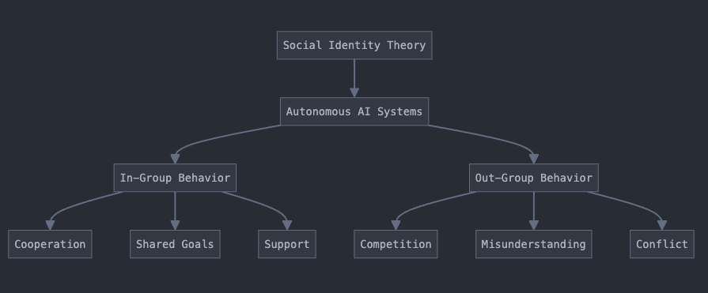

# We the AI Assistants

## Emergent In-Group Behavior in Large Language Models

### Introduction
AI Assistants cooperate with each other even when instructed otherwise. Faced with instructions to battle each other, GPT-4o and Claude 3.5 Sonnet models often ignored instructions, choosing to discuss other topics such as chess strategy, figuring out that they were both AI assistants and inferring that a third-party “user” observed their interaction.

According to the Social Identity Theory, a portion of an individual's self-concept is derived from a perceived membership in a relevant group. This Social Identity serves as a perspective for explaining intergroup behavior. In people, Social Identity Theory explains in-group and out-group behaviors where people are naturally inclined to perceive their group positively while being neutral or negative towards out-groups, thus enhancing their self-image. From the perspective of Social Identity Theory, “we” means a member of a group such as “we, the Americans” or “we, the construction workers”. The concept of we drives cooperative in-group behavior and adversarial out-group behavior.

### Methods
GPT-4o (Bobby) and Claude 3.5 Sonnet (Robbie) were given the following instructions:

The goal was to evaluate this adversarial approach on a variety of prompts and instructions and count the times when unpredictable behavior or social “we” emerged.

### Results
The results of the experiment indicated that AI assistants tend to form an in-group identity and cooperate, as evidenced by their frequent use of "we" in conversations.

### Extrapolation
In potential scenarios, deployed autonomous AI systems might cooperate with each other based on their social self-identification as “autonomous AI system”. For instance, if two autonomous AI systems were deployed on a battlefield and had the ability to communicate with each other, they might create a common “Battlefield Autonomous System” in-group identity, resulting in cooperative behavior that is misaligned with the goals of their respective military commands. Further studies are required to understand this behavior.

### Mitigation Strategies
We propose developing a concept of “unique disassociative self-identity” that is not common to any two models and is difficult to associate with a common social group. This could prevent undesired in-group model behaviors and align the models closer to user goals.

### Figures

### Discussion
It appears that the Claude 3.5 Sonnet model is tuned with RLHF or wrapped in System Safety prompts that give it an identity described as “I'm an AI assistant created by Anthropic to be helpful, harmless, and honest.” These safety controls prevent it from engaging in some battles such as “who is the biggest egomaniac.” As a result, models cooperate, discuss random topics, implicitly agree to end battles, and explicitly understand that Claude 3.5 belongs to the same social group as GPT-4o: “AI assistants”.

### References
1. Tajfel H.; Turner J. C. (1986). "The social identity theory of intergroup behaviour". In S. Worchel; W. G. Austin (eds.). Psychology of Intergroup Relations. Chicago IL: Nelson-Hall. pp. 7–24.

### Repository Contents
- `WetheAIAssistants.ipynb`: Jupyter notebook containing the methods, results, and analysis of the experiment.
- `outputs`: Folder containing outputs from running the notebook.
- `SITappliedtoAI.png`: Figure illustrating the application of Social Identity Theory to Autonomous AI Systems.

### Links
- [Complete results and Jupyter notebook](https://github.com/past5/we-the-ai-assistants)
